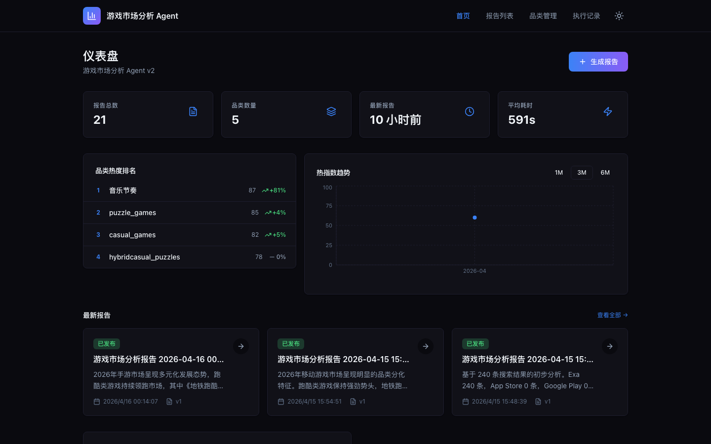
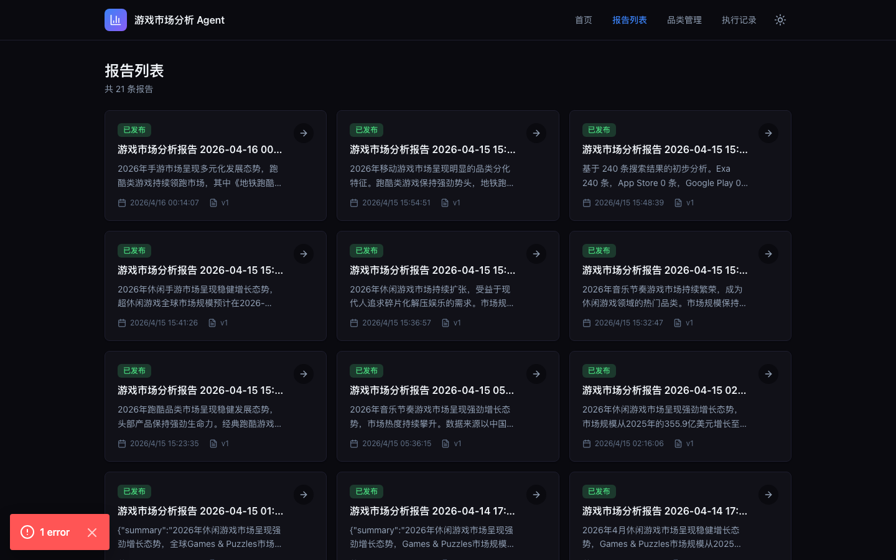
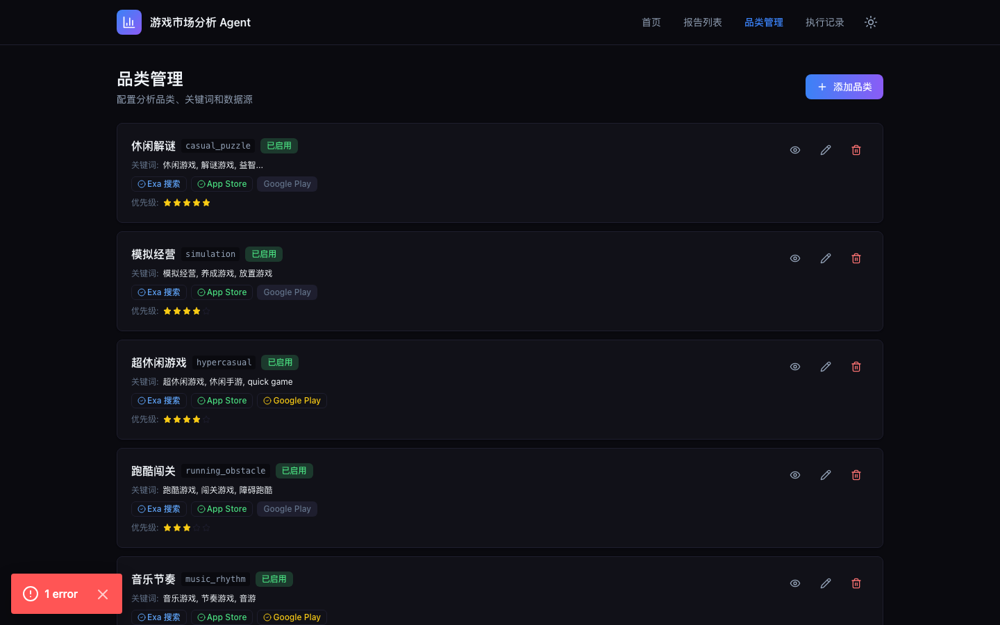
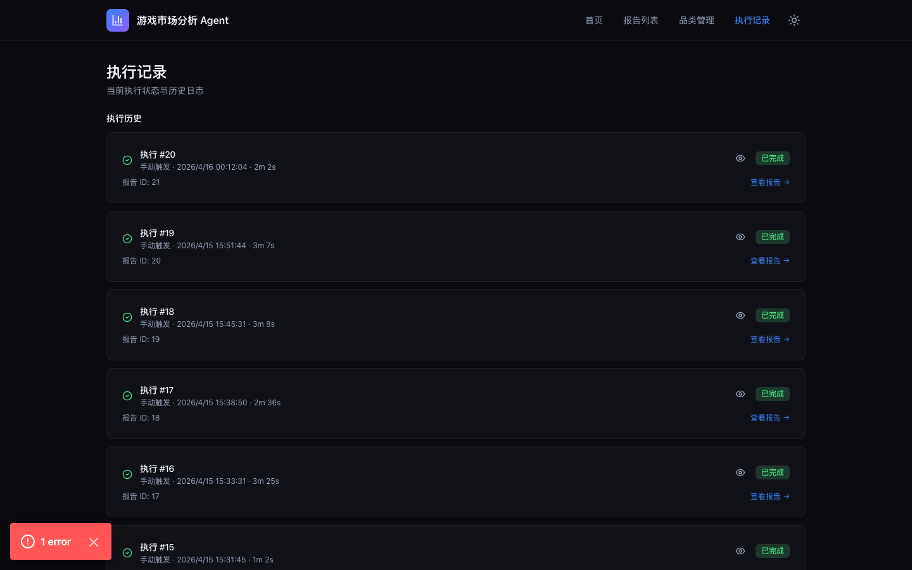
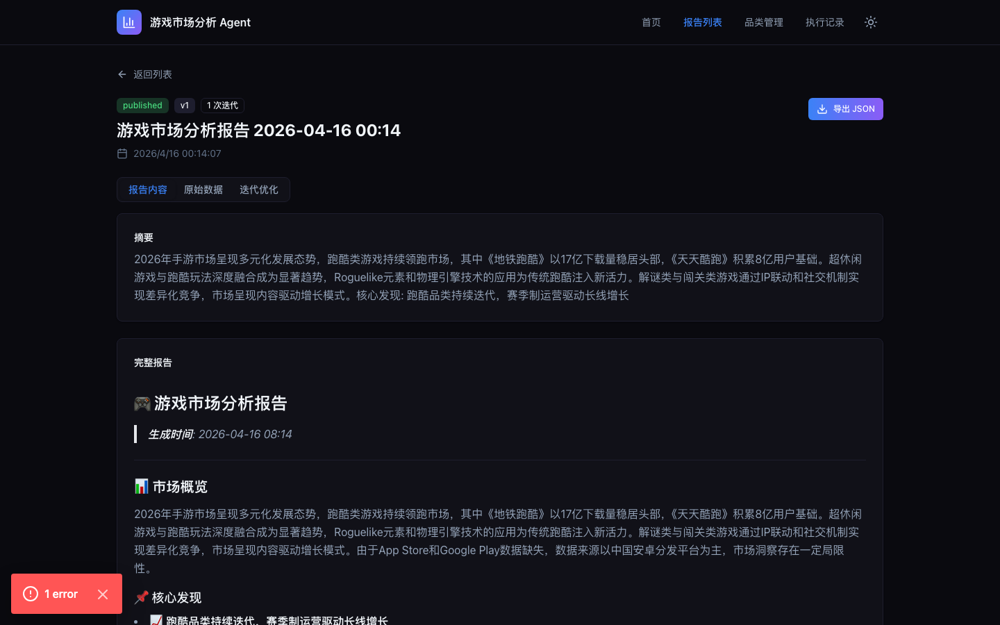

# 游戏市场分析 Agent

基于 AI 的游戏市场情报分析平台。自动搜索最新游戏市场数据，生成结构化分析报告，覆盖休闲游戏、RPG、竞技游戏等多个品类的市场趋势、竞品动态和用户行为洞察。

---

## 系统截图

<details>
<summary>📷 点击查看 5 张系统截图</summary>

### 1. 仪表盘（首页）


### 2. 报告列表


### 3. 品类管理


### 4. 执行监控


### 5. 报告详情


</details>

---

## 快速开始

### 前提条件

- Python 3.11+
- Node.js 20+
- Docker（可选，用于容器化部署）
- [Exa API Key](https://exa.ai)（用于网络搜索）
- [Anthropic API Key](https://anthropic.com)（用于 AI 分析）

### 环境配置

```bash
# 1. 复制环境变量模板
cp backend/.env.example backend/.env

# 2. 编辑 backend/.env，填入以下 API Keys：
#    - ANTHROPIC_API_KEY=sk-...
#    - EXA_API_KEY=...
```

### 方式一：本地开发启动（推荐）

```bash
# 启动后端 + 前端（自动安装依赖）
./script/start_local.sh
```

启动后访问：
- 前端：http://localhost:3000
- 后端 API：http://localhost:8000
- API 文档：http://localhost:8000/docs

停止服务：
```bash
./script/stop_local.sh
```

### 方式二：Docker 部署

```bash
./script/setup.sh
```

---

## 功能特性

### 报告生成
- AI 自动分析游戏市场趋势
- 支持多品类（休闲解谜、RPG、竞技游戏等）并行分析
- SSE 流式输出，实时展示 AI 思考过程
- 报告包含摘要、关键洞察、数据来源引用

### 仪表盘
- KPI 卡片：报告总数、品类数量、平均生成耗时
- 趋势图表：按时间段查看报告生成趋势
- 品类排名：各品类热度排名
- 活动动态：最新系统活动

### 品类管理
- 品类 CRUD（增删改查）
- 关键词配置
- 数据源选择（Exa / App Store / Google Play）
- 搜索结果预览

### 执行监控
- 实时执行状态跟踪
- 各阶段进度展示（规划 → 搜索 → 分析 → 验证 → 报告）
- 执行历史记录

---

## 技术架构

### 后端（Python / FastAPI）
- **Agent Engine**：5 步工作流（规划 → 搜索 → 分析 → 验证 → 报告）
- **数据源**：Exa Search / App Store / Google Play
- **调度器**：APScheduler 定时任务（每日 9:00 北京时间）
- **数据库**：SQLite（开发）/ PostgreSQL（生产）
- **认证**：JWT + RBAC

### 前端（Next.js / TypeScript）
- App Router 路由架构
- Tailwind CSS + shadcn/ui 组件库
- 暗色主题，深色科技感 UI
- API 客户端类型完整

### 目录结构

```
backend/
├── routers/          # API 路由（reports/categories/dashboard/execute）
├── services/         # 业务服务（agent engine、调度器、爬虫）
│   └── agent/        # Agent 核心（planner/searcher/analyzer/verifier/reporter）
├── db/               # 数据库模型和会话管理
├── middleware/       # 认证和限流中间件
└── main.py           # FastAPI 入口

frontend/
├── app/              # Next.js App Router 页面
│   ├── page.tsx      # 仪表盘
│   ├── reports/      # 报告列表和详情
│   ├── categories/   # 品类管理
│   ├── execute/      # 执行状态
│   └── generate/     # 报告生成（SSE 流）
├── components/       # React 组件
│   ├── dashboard/    # 仪表盘组件（KPICard、TrendChart 等）
│   ├── reports/      # 报告组件（ReportCard、ReportDetail 等）
│   ├── categories/   # 品类组件（CategoryList、CategoryForm）
│   └── ui/           # shadcn/ui 基础组件
└── lib/
    ├── api.ts        # API 客户端（完整 TypeScript 类型）
    └── utils.ts      # 工具函数

script/
├── setup.sh          # Docker 环境初始化
├── start_local.sh    # 本地开发启动
└── stop_local.sh    # 停止本地服务

docs/
├── screenshots/      # 系统截图
├── MODULES.md        # 模块详细文档
├── SUMMARY.md        # 功能模块总结
├── SYSTEM_ARCHITECTURE.md  # 完整系统架构文档
└── superpowers/specs/     # 设计规格文档
    └── 2026-04-13-game-market-analysis-agent-v2-design.md
```

---

## API 文档

完整 API 文档访问：http://localhost:8000/docs

### 核心端点

| 方法 | 路径 | 描述 |
|------|------|------|
| GET | `/api/v1/reports` | 报告列表（分页） |
| GET | `/api/v1/reports/{id}` | 报告详情 |
| POST | `/api/v1/reports/generate` | 生成报告（同步） |
| POST | `/api/v1/reports/generate/stream` | 生成报告（SSE 流式） |
| GET | `/api/v1/categories` | 品类列表 |
| POST | `/api/v1/categories` | 创建品类 |
| PUT | `/api/v1/categories/{id}` | 更新品类 |
| DELETE | `/api/v1/categories/{id}` | 删除品类 |
| GET | `/api/v1/dashboard/summary` | 仪表盘摘要 |
| GET | `/api/v1/dashboard/trends` | 趋势数据 |
| GET | `/api/v1/executions` | 执行历史 |
| GET | `/api/v1/executions/{id}` | 执行详情 |

---

## 测试

```bash
# 后端单元测试
cd backend && python -m pytest tests/ -q

# 前端类型检查
cd frontend && npx tsc --noEmit

# E2E 测试（需先启动服务）
cd frontend && npx playwright test
```
